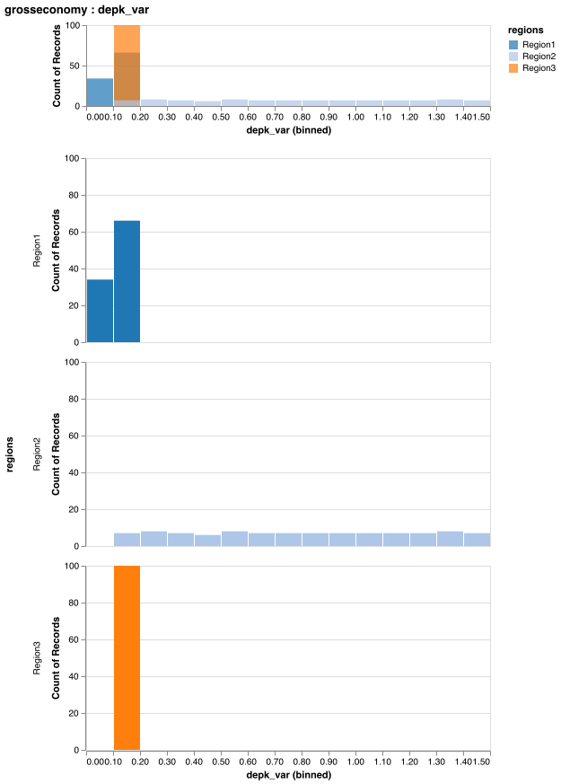

# How-to Guide 3: Conduct Monte Carlo Simulations and Sensitivity Analysis

Mimi includes a host of routines which support running Monte Carlo simulations and various sensitivity analysis methods on Mimi models. Tutorial 5: Monte Carlo Simulations and Sensitivity Analysis Support is a good starting point for learning about these methods.  This how-to guide includes more detail and optionality, covering more advanced options such as non-stochastic scenarios and running multiple models, which are not yet included in the tutorial.

## Overview 

Running Monte Carlo simulations, and proximal sensitivity analysis, in Mimi can be broken down into three primary user-facing elements:

1. The [`@defsim`](@ref) macro, which defines random variables (RVs) which are assigned distributions and associated with model parameters, and override the default (random) sampling method.

2. The [`run`](@ref) function, which runs a simulation instance, setting the model(s) on which a simulation definition can be run within that, generates all trial data with `generate_trials!`, and has several with optional parameters and optional callback functions to customize simulation behavior. 

3. The `analyze` function, which takes a simulation instance, analyzes the results and returns results specific to the type of simulation passed in. 

The rest of this document will be organized as follows:

1. The [`@defsim`](@ref) macro
2. The [`run`](@ref) function
3. The `analyze` function
4. Plotting and the Explorer UI
5. Other Useful Functions
6. Examples

*We will refer separately to two types, `SimulationDef` and `SimulationInstance`.  They are referred to as `sim_def` and `sim_inst` respectively as function arguments, and `sd` and `si` respectively as local variables.*

## 1. The `@defsim` macro

The first step in a Mimi sensitivity analysis is using the [`@defsim`](@ref) macro to define and return a `SimulationDef{T}`. This simulation definition contains all the definition information in a form that can be applied at run-time. The `T` in `SimulationDef{T}` is any type that your application would like to live inside the `SimulationDef` struct, and most importantly specifies the sampling strategy to be used in your sensitivity analysis.  

We have implemented four types for `T <: AbstractSimulationData`:

1. Simple random-sampling Monte Carlo Simulation (`MCSData`),
2. Latin Hypercube Sampling (`LHSData`)
3. Sobol sampling and analysis (`SobolData`)
4. Delta sampling and analysis (`DeltaData`) - **Beta**, we don't recommend use yet

We also define type constants with friendlier names for these parameterized types:

```julia
const MonteCarloSimulationDef = SimulationDef{MCSData}
const MonteCarloSimulationInstance = SimulationInstance{MCSData}

const LatinHypercubeSimulationDef = SimulationDef{LHSData}
const LatinHypercubeSimulationInstance = SimulationInstance{LHSData}

const SobolSimulationDef = SimulationDef{SobolData}
const SobolSimulationInstance = SimulationInstance{SobolData}

const DeltaSimulationDef = SimulationDef{DeltaData}
const DeltaSimulationInstance = SimulationInstance{DeltaData}
```

In order to build the information required at run-time, the [`@defsim`](@ref) macro carries out several tasks including the following.

### Define Random Variables (RVs)

The macro must define random variables (RVs) by assigning names to distributions, which can be any object that supports the following function:
  
  - `rand(dist, count::Int=1)` which produces a single value when `count == 1`, else a `Vector` of values.
  
If using Latin Hypercube Sampling (LHS) is used, the following function must also be defined:

  - `quantile(dist, quantiles::Vector{Float64})` which returns values for the given `quantiles` of the distribution.

In addition to the distributions available in the `Distributions` package, Mimi provides the following options.  Note that these are not exported by default, so they need to either be explicitly imported (ie. `import Mimi: EmpiricalDistribution`) or prefixed with `Mimi.` when implemented (ie. `Mimi.EmpiricalDistribution(vals, probs)`):

- `EmpiricalDistribution`, which takes a vector of values and (optional) vector of probabilities and produces samples from these values using the given probabilities, if provided, or equal probability otherwise. To use this in a [`@defsim`](@ref), you might do:

  ```julia
  using CSVFiles
  using DataFrames
  using Mimi
  import Mimi: EmpiricalDistribution # not currently exported so you just need to grab it

  # read in your values
  values = load("path_to_values_file"; header_exists = false) |> DataFrame
  # read in your probabilities (optional, if none are provided we assume all equal)
  # note that the probabilities need to be Float type and should roughly add to 1
  probs = load("path_to_probabilities_file"; header_exists = false) |> DataFrame

  # create your simulation
  @defsim  begin
      ...
      RandomVariable1 = EmpiricalDistribution(values, probs)
      ...
  end
  ```
  Note there are many ways to load values, we use DataFrames and CSVFiles above but there might be an easier way depending on what packages you like

- `SampleStore{T}`, which stores a vector of samples that are produced in order by the `rand` function. This allows the user to to store a predefined set of values (useful for regression testing) and it is used by the LHS method, which draws all required samples at once at equal probability intervals and then shuffles the values. It is also used when rank correlations are specified, since this requires re-ordering draws from random variables.

- `ReshapedDistribution`, which supports use of vector-valued distributions, i.e., those that generate   vectors of values for each single draw. An example (that motivated this addition) is the `Dirichlet` distribution, which produces a vector of values that sum to 1. To use this in [`@defsim`](@ref), you might do:

  ```julia
    rd = ReshapedDistribution([5, 5], Dirichlet(25,1))
  ```
  This code creates a pseudo-distribution that, for each draw, produces a 5x5 matrix of values that sum to 1.

### Apply RVs to model parameters

**For all applications in this section, it is important to note that for each trial, a random variable on the right hand side of an assignment  will take on the value of a *single* draw from the given distribution.  This means that even if the random variable is applied to more than one parameter on the left hand side (such as assigning to a slice), each of these parameters will be assigned the same value, not different draws from the distribution.**

The macro next defines how to apply the values generated by each RV to model parameters based on a pseudo-assignment operator. The left hand side of these assignments can be either a `param`, which must refer to a shared model parameter, or `comp.param` which refers to an unshared model parameter specific to a component.

- `param = RV` or `comp.param = RV` replaces the values in the parameter with the value of the RV for the current trial.
- `param += RV` or `comp.param += RV` replaces the values in the parameter with the sum of the original value and the value of the RV for the current trial.
- `param *= RV` or `comp.param *= RV` replaces the values in the parameter with the product of the original value and the value of the RV for the current trial.

As described below, in [`@defsim`](@ref), you can apply distributions to specific slices of array parameters, and you can "bulk assign" distributions to elements of a vector or matrix using a more condensed syntax. Note that these relationship assignments are referred to as **transforms**, and are referred to later in this documentation in the `add_transform!` and `delete_transform!` helper functions.

#### Apply RVs to model parameters: Assigning to array slices

Options for applying distributions to array slices is accomplished using
array access syntax on the left-hand side of an assignment. The assignment
may use any of these assignment operators: `=`, `*=`, or `+=`, as described
above. Slices can be indicated using a variety of specifications. Assume we
define two parameters in [`@defcomp`](@ref) as
```
  foo = Parameter(index=[regions])
  bar = Parameter(index=[time, regions])
```
with `regions` defined as `[:USA, :CAN, :MEX, :ROW]`

We can assign distributions to the elements of `foo` several ways:

* Using a symbol or string or tuple of symbols or strings. Note that values specified without a ":" prefix or double quotes are treated as symbols. To specify strings, quote them the usual way.
  * `foo[USA] = Uniform(0, 1)` would assign the RV to `foo[:USA]` only.
  * `foo[(USA, CAN, MEX)] = Uniform(0, 1)` would assign the same RV to 3 elements of `foo`. 
    That is, a single value is drawn from the RV with distribution `Uniform(0, 1)` and this
    value is assigned to all three elements of `foo`.
* A `:`, indicating all elements for this dimension
  * `foo[:] = Normal(10.0 3.0)` would use a draw from the Normal RV for all elements of `foo`.
* A `:` range, with or without a step, or a tuple of integers
  * `bar[2050:10:2080, :] = Uniform(2, 3)` would assign a single Uniform RV to all regions for 
    time steps with labels 2050, 2060, 2070, and 2080.
  * `bar[(2050, 2060, 2070, 2080), :] = Uniform(2, 3)` does the same thing using a tuple of values.

If `regions` were defined using strings, as in `["USA", "CAN", "MEX", "ROW"]`, the examples above would be
written as `foo["USA"] = Uniform(0, 1)` and so on.

#### Apply RVs to model parameters: Assigning a vector of distributions

In some cases, it's more convenient to assign a vector of distributions (e.g., with different functional forms or parameters) to a single parameter. For example we can use the following syntax:

```julia
  foo = [USA => Uniform(0, 1),
         (CAN, MEX) => Uniform(1, 2),
         ROW => Normal(10, 3)]
```

which is equivalent to:

```
  foo[USA] = Uniform(0, 1),
  foo[(CAN, MEX)] = Uniform(1, 2),
  foo[ROW] = Normal(10, 3)]
```

To assign to parameters with more than one dimension, use square brackets around the dimensions
on the left-hand side of each `=>` operator, e.g.,

```
  bar = [[2050, USA] => Uniform(0, 1),
         [:, (CAN, MEX)] => Uniform(1, 2),
         [2010:10:2080, ROW] => Normal(10, 3)]
```

Currently, the more condensed syntax (using the pair operator `=>`) supports only direct assignment 
of RV value, i.e., you cannot combine this with the `*=` or `+=` operators.

### Specify a Sampling Strategies 

As previously mentioned and included in the tutorial, the [`@defsim`](@ref) macro uses the call to `sampling` to type-parameterize the `SimulationDef` with one of three types, which in turn direct the sampling strategy of the simulation. This is done with the `sampling` line of the macro.

1. Simple random-sampling Monte Carlo Simulation (`MCSData`),
2. Latin Hypercube Sampling (`LHSData`)

*Latin Hypercube sampling divides the distribution into equally-spaced quantiles, obtains values at those quantiles, and then shuffles the values. The result is better representation of the tails of the distribution with fewer samples than would be required for purely random sampling.*

3. Sobol sampling and analysis (`SobolData`)
4. Delta sampling and analysis (`DeltaData`) - **Beta**, we don't recommend use yet

### Include Sampling Strategy-specific Parameters

Certain sampling strategies support (or necessitate) further customization. These may include:

- rank correlations (LHS)): In some cases, it may be desireable to define  rank correlations between pairs of random variables. Approximate rank correlation is achieved by re-ordering vectors of random draws as per Iman and Conover (1982). 
- extra parameters (Sobol): Sobol sampling allows specification of the sample size N and whether or not one wishes to calculate second-order effects.


## 2. The [`run`](@ref) function

In it's simplest use, the [`run`](@ref) function generates and iterates over generated trial data, perturbing a chosen subset of Mimi's model parameters, based on the defined distributions, and then runs the given Mimi model(s). The function retuns an instance of `SimulationInstance`, holding a copy of the original `SimulationDef` with additional trial information as well as a list of references ot the models and the results. Optionally, trial values and/or model results are saved to CSV files.

### Function signature

The full signature for the [`run`](@ref) is:

```
function Base.run(sim_def::SimulationDef{T}, models::Union{Vector{Model}, Model}, samplesize::Int;
                 ntimesteps::Int=typemax(Int), 
                 trials_output_filename::Union{Nothing, AbstractString}=nothing, 
                 results_output_dir::Union{Nothing, AbstractString}=nothing, 
                 pre_trial_func::Union{Nothing, Function}=nothing, 
                 post_trial_func::Union{Nothing, Function}=nothing,
                 scenario_func::Union{Nothing, Function}=nothing,
                 scenario_placement::ScenarioLoopPlacement=OUTER,
                 scenario_args=nothing,
                 results_in_memory::Bool=true) where T <: AbstractSimulationData
```

Using this function allows a user to run the simulation definition `sim_def` for the `models` using `samplesize` samples.

Optionally the user may run the `models` for `ntimesteps`, if specified, else to the maximum defined time period. Note that trial data are applied to all the associated models even when running only a portion of them.   

If provided, the generated trials and results will be saved in the indicated `trials_output_filename` and `results_output_dir` respectively. If `results_in_memory` is set to false, then results will be cleared from memory and only stored in the `results_output_dir`. After [`run`](@ref), the results of a `SimulationInstance` can be accessed using the `getdataframe` function with the following signature, which returns a `DataFrame`. 

```
getdataframe(sim_inst::SimulationInstance, comp_name::Symbol, datum_name::Symbol; model::Int = 1)
```

If `pre_trial_func` or `post_trial_func` are defined, the designated functions are called  just before or after (respectively) running a trial. The functions must have the signature:
```
fn(sim_inst::SimulationInstance, trialnum::Int, ntimesteps::Int, tup::Tuple)
```
where `tup` is a tuple of scenario arguments representing one element in the cross-product of all scenario value vectors. In situations in which you want the simulation loop to run only some of the models, the remainder of the runs can be handled using a `pre_trial_func` or `post_trial_func`.

If provided, `scenario_args` must be a `Vector{Pair}`, where each `Pair` is a symbol and a  `Vector` of arbitrary values that will be meaningful to `scenario_func`, which must have the signature:
```
scenario_func(sim_inst::SimulationInstance, tup::Tuple)
```

By default, the scenario loop encloses the simulation loop, but the scenario loop can be placed inside the simulation loop by specifying `scenario_placement=INNER`. When `INNER`  is specified, the `scenario_func` is called after any `pre_trial_func` but before the model is run.

Finally, [`run`](@ref) returns the type `SimulationInstance` that contains a copy of the original `SimulationDef` in addition to trials information (`trials`, `current_trial`, and `current_data`), the model list `models`, and results information in `results`.

### Internal Functions to [`run`](@ref)

The following functions are internal to [`run`](@ref), and do not need to be understood by users but may be interesting to understand.

#### The set_models! function

The [`run`](@ref) function sets the model or models to run using `set_models!` function and saving references to these in the `SimulationInstance` instance.  The `set_models!` function has several methods for associating the model(s) to run with the `SimulationDef`:
	
```
set_models!(sim_inst::SimulationInstance, models::Vector{Model})
set_models!(sim_inst::SimulationInstance, m::Model)
set_models!(sim_inst::SimulationInstance, mm::MarginalModel)
```

#### The generate_trials! function

The `generate_trials!` function is used to pre-generate data using the given `samplesize` and save all random variable values in the file `filename`. Its calling signature is:

```julia
  generate_trials!(sim_def::SimulationDefinition, samplesize::Int; filename::Union{String, Nothing}=nothing)
```

If the `sim_def` parameter has multiple scenarios and the `scenario_loop` placement is set to `OUTER` this function must be called if the user wants to ensure the same trial data be used in each scenario. If this function is not called, new trial data will be generated for each scenario. 

Also note that if the `filename` argument is used, all random variable draws are saved to the given filename. Internally, any `Distribution` instance is converted to a `SampleStore` and the values are subsequently returned in the order generated when `rand!` is called.

### Non-stochastic Scenarios

In many cases, scenarios (which we define as a choice of values from a discrete set for one or more parameters) need to be considered in addition to the stochastic parameter variation. To support scenarios, [`run`](@ref) also offers iteration over discrete scenario values, which are passed to [`run`](@ref) via the keyword parameter `scenario_args::Dict{Symbol, Vector}`. For example, to iterate over scenario values "a", and "b", as well as, say, discount rates `0.025, 0.05, 0.07`, you could provide the argument:

`scenario_args=Dict([:name => ["a", "b"], :rate => [0.025, 0.05, 0.07]])`

Of course, the SA subsystem does not know what you want to do with these values, so the user must also provide a callback function in the `scenario_func` argument. This function must be defined with the signature:

`function any_name_you_like(sim_inst::SimulationInstance, tup)`

where `tup` is an element of the set of tuples produced by calling `Itertools.product()` on all the scenario arguments. In the example above, this would produce the following vector of tuples:

`[("a", 0.025), ("b", 0.025), ("a", 0.03), ("b", 0.03), ("a", 0.05), ("b", 0.05)]`.

This approach allows all scenario combinations to be iterated over using a single loop. A final keyword argument, `scenario_placement::ScenarioLoopPlacement` indicates whether the scenario loop should occur inside or outside the loop over stochastic trial values. The type `ScenarioLoopPlacement` is an `enum` with values `INNER` and `OUTER`, the latter being the default placement.

In approximate pseudo-julia, these options produce the following behavior:

*scenario_placement=OUTER*
```julia
for tup in scenario_tuples
  scenario_func(tup)

  # for each scenario, run all SA trials
  for trial in trials
    trial_data = get_trial_data(trial)
    apply_trial_data()

    pre_trial_func()
    run(model)
    post_trial_func()
  end
end
```

*scenario_placement=INNER*
```julia
for trial in trials
  trial_data = get_trial_data(trial)
  apply_trial_data()

  # for each SA trial, run all scenarios
  for tup in scenario_tuples
    scenario_func(tup)

    pre_trial_func()
    run(model)
    post_trial_func()
  end
end
```

### Running Multiple Models

In some simulations, a baseline model needs to be compared to one or more models that are perturbed parametrically or structurally (i.e., with different components or equations.) To support this, the `SimulationInstance` type holds a vector of `Model` instances, and allows the caller to specify how many of these to run automatically for each trial. Note that regardless of how many models are run, the random variables are applied to all of the models associated with the simulation.

By default, all defined models are run. In some cases, you may want to run some of the models "manually" in the `pre_trial_func` or `post_trial_func`, which allow you to make arbitrary modifications to these additional models.

## 3. The `analyze` function

The `analyze` function takes a simulation instance, runs a sensitivity analysis method as determined by the type of simulation instance, and returns the results. It is currently defined for a `SobolSimulationInstance` and the `DeltaSimulationInstance` (**Beta**) subtypes of `SimulationInstance`.

This function wraps the `analyze` function in the [GlobalSensitivityAnalysis.jl](https://github.com/lrennels/GlobalSensitivityAnalysis.jl) package, so please view the README of this package for the most up to date information. 

## 4. Plotting and the Explorer UI

As described in the User Guide, Mimi provides support for plotting using [VegaLite](https://github.com/vega/vega-lite) and [VegaLite.jl](https://github.com/fredo-dedup/VegaLite.jl) within the Mimi Explorer UI and `Mimi.plot` function. These functions not only work for `Model`s, but for `SimulationInstance`s as well. 

In order to invoke the explorer UI and explore all of the saved variables from the `save` list of a `SimulationInstance`, simply call the function [`explore`](@ref) with the simulation as the required argument as shown below.  This will produce a new browser window containing a selectable list of variables, each of which produces a graphic.
 
```julia
run(sim_inst)
explore(sim_inst)
```

There are several optional keyword arguments for the [`explore`](@ref) method, as shown by the full function signature:
```julia
explore(sim_inst::SimulationInstance; title="Electron", model_index::Int = 1, scen_name::Union{Nothing, String} = nothing, results_output_dir::Union{Nothing, String} = nothing)
```
The `title` is the optional title of the application window, the `model_index` defines which model in your list of `models` passed to [`run`](@ref) you would like to explore (defaults to 1), and `scen_name` is the name of the specific scenario you would like to explore if there is a scenario dimension to your simulation.  Note that if there are multiple scenarios, this is a **required** argument. Finally, if you have saved the results of your simulation to disk and cleared them from memory using [`run`](@ref)'s `results_in_memory` keyword argument flag set to `false`, you **must** provide a `results_output_dir` which indicates the parent folder for all outputs and potential subdirectories, identical to that passed to [`run`](@ref).


Alternatively, in order to view just one variable, call the (unexported) function `Mimi.plot` as below to return a plot object and automatically display the plot in a viewer, assuming `Mimi.plot` is the last command executed.  Note that `plot` is not exported in order to avoid namespace conflicts, but a user may import it if desired. This call will return the type `VegaLite.VLSpec`, which you may interact with using the API described in the [VegaLite.jl](https://github.com/fredo-dedup/VegaLite.jl) documentation.  For example, [VegaLite.jl](https://github.com/fredo-dedup/VegaLite.jl) plots can be saved in many typical file formats such as  [PNG](https://en.wikipedia.org/wiki/Portable_Network_Graphics), [SVG](https://en.wikipedia.org/wiki/Scalable_Vector_Graphics), [PDF](https://en.wikipedia.org/wiki/PDF) and [EPS](https://en.wikipedia.org/wiki/Encapsulated_PostScript) files. You may save a plot using the `save` function. Note that while `explore(sim_inst)` returns interactive plots for several graphs, `Mimi.plot(si, :foo, :bar)` will return only static plots. 

```julia
using VegaLite
run(sim_inst)
p = Mimi.plot(sim_inst, :component1, :parameter1)
save("figure.svg", p)
```

Note the function signature below, which has the same keyword arguments and requirements as the aforementioned [`explore`](@ref) method, save for `title`.
```julia
plot(sim_inst::SimulationInstance, comp_name::Symbol, datum_name::Symbol; interactive::Bool = false, model_index::Int = 1, scen_name::Union{Nothing, String} = nothing, results_output_dir::Union{Nothing, String} = nothing)
```



## 5. Other Useful Functions

### Simulation Modification Functions

A small set of unexported functions are available to modify an existing `SimulationDefinition`.  The functions include:

* `delete_RV!(sim_def::SimulationDef, name::Symbol)` - deletes the random variable with name `name` from the Simulation Definition `sim_def`, along with all transformations using that random variable
* `add_RV!(sim_def::SimulationDef, name::Symbol, dist::Distribution)` - add the random variable with the name `name` from the Simulation Definition `sim_def` 
* `replace_RV!(sim_def::SimulationDef, name::Symbol, dist::Distribution)` - replace the random variable with name `name` in Simulation Definition with a random variable of the same `name` but with the distribution `Distribution`

* `delete_transform!(sim_def::SimulationDef, name::Symbol)!` - Delete all data transformations in Simulation Definition `sim_def` (i.e., replacement, addition or multiplication) of original data values with values drawn from the random variable named `name`
* `add_transform!(sim_def::SimulationDef, paramname::Symbol, op::Symbol, rvname::Symbol, dims::Vector=[])!` - Create a new `TransformSpec` based on `paramname`, `op`, `rvname` and `dims` to the Simulation Definition `sim_def`. The symbol `rvname` must refer to an existing random variable, and `paramname` must refer to an existing shared model parameter that can thus be accessed by that name. Use the following signature if your `paramname` is an unshared model parameter specific to a component. If `dims` are provided, these must be legal subscripts of `paramname`. Op must be one of :+=, :*=, or :(=).
* `add_transform!(sim_def::SimulationDef, compname::Symbol, paramname::Symbol, op::Symbol, rvname::Symbol, dims::Vector=[])!` - Create a new TransformSpec based on `compname`, `paramname`, `op`, `rvname` and `dims` to the Simulation definition `sim_def`, and update the Simulation's NamedTuple type. The symbol `rvname` must refer to an existing RV, and `compname` and `paramname` must holding an existing component and parameter. If `dims` are provided, these must be legal subscripts of `paramname`. Op must be one of :+=, :*=, or :(=).

For example, say a user starts off with a SimulationDefinition `MySimDef` with a parameter `MyParameter` drawn from the random variable `MyRV` with distribution `Uniform(0,1)`.  

Case 1: The user wants this random variable to draw from a new distribution, say `Normal(0,1)`, which will affect all parameters with transforms attached to this random variable.
```
using Distributions
using Mimi
replace_RV!(MySimDef, MyRV, Normal(0,1))
```
Case 2: The user parameter `MyParameter` to to take on the value of a random draw from a `Normal(2,0.1)` distribution.  We assume this requires a new random variable, because no random variable has this distribution yet.
```
using Distributions
using Mimi
add_RV!(MySimDef, :NewRV, Normal(2, 0.1))
add_transform!(MySimDef, :MyParameter, :=, :NewRV)
```

* `add_save!(sim_def::SimulationDef, comp_name::Symbol, datum_name::Symbol)` - Add to Simulation Definition`sim_def` a "save" instruction for component `comp_name` and parameter or variable `datum_name`. This result will be saved to a CSV file at the end of the simulation.    
* `delete_save!(sim_def::SimulationDef, comp_name::Symbol, datum_name::Symbol)` - Delete from Simulation Definition `sim_def` a "save" instruction for component `comp_name` and parameter nor variable `datum_name`. This result will no longer be saved to a CSV file at the end of the simulation.

### Helper Functions

```
"""
  get_simdef_rvnames(sim_def::SimulationDef, name::Union{String, Symbol})

A helper function to support finding the keys in a Simulation Definition `sim_def`'s
rvdict that contain a given `name`. This can be particularly helpful if the random 
variable was set via the shortcut syntax ie. my_parameter = Normal(0,1) and thus the
`sim_def` has automatically created a key in the format `:my_parameter!x`. In this 
case this function is useful to get the key and carry out modification functions 
such as `replace_rv!`.
"""

function get_simdef_rvnames(sim_def::SimulationDef, name::Union{String, Symbol})
    names = String.([keys(sim_def.rvdict)...])
    matches = Symbol.(filter(x -> occursin(String(name), x), names))
end
```
As shown in the examples below, and described above, parameters can be assigned unique random variables under the hood without explicitly declaring the RV.  Fore example, instead of pairing
```
rv(name) = Uniform(0.2, 0.8)
share = name1
```
we can write
```
share = Uniform(0.2, 0.8)
```
When this is done, Mimi will create a new unique RV with a unique name `share!x` where `x` is an integer determined by internal processes that gaurantee it to be unique in this `sim_def`.  This syntax is therefore not recommended if the user expects to want to reference that random variable using the aforementioned modification functions.  That said, if the user does need to do so we have added a helper function `get_simdef_rvnames(sim_def::SimulationDef, name::Union{String, Symbol})` which will return the unique names of the random variables that start with `name`.  In the case above, for example, `get_simdef_rvnames(sim_def, :share)` would return `[share!x]`.  In a case where share had multiple dimensions, like three regions, it would return `[share!x1, share!x2, share!x3]`.  

### Payload Functions

* `set_payload!`
* `payload`

## 6. Examples

The following example is derived from `"Mimi.jl/test/mcs/test_defmcs.jl"`.

```julia
using Mimi
using Distributions

N = 100

sd = @defsim begin
    # Define random variables. The rv() is required to disambiguate an
    # RV definition name = Dist(args...) from application of a distribution
    # to a model parameter. This makes the (less common) naming of an
    # RV slightly more burdensome, but it's only required when defining
    # correlations or sharing an RV across parameters.
    rv(name1) = Normal(1, 0.2)
    rv(name2) = Uniform(0.75, 1.25)
    rv(name3) = LogNormal(20, 4)

    # assign RVs to model Parameters
    share = Uniform(0.2, 0.8)
    sigma[:, Region1] *= name2
    sigma[2020:5:2050, (Region2, Region3)] *= Uniform(0.8, 1.2)

    depk = [Region1 => Uniform(0.08, 0.14),
            Region2 => Uniform(0.10, 1.50),
            Region3 => Uniform(0.10, 0.20)]

    sampling(LHSData, corrlist=[(:name1, :name2, 0.7), (:name1, :name3, 0.5)])
    
    # indicate which parameters to save for each model run. Specify
    # a parameter name or [later] some slice of its data, similar to the
    # assignment of RVs, above.
    save(grosseconomy.K, grosseconomy.YGROSS, emissions.E, emissions.E_Global)
end

Mimi.reset_compdefs()
include("../../examples/tutorial/02-multi-region-model/main.jl")

m = model

# Optionally, user functions can be called just before or after a trial is run
function print_result(m::Model, sim_inst::SimulationInstance, trialnum::Int)
    ci = Mimi.compinstance(m.mi, :emissions)
    value = Mimi.get_variable_value(ci, :E_Global)
    println("$(ci.comp_id).E_Global: $value")
end

# set some some constants
trials_output_filename = joinpath(output_dir, "trialdata.csv")
results_output_dir = joinpath(tempdir(), "sim")
N = 100

# Run trials and save trials results to the indicated directories
si = run(sd, m, N; trials_output_filename=trials_output_filename, results_output_dir=results_output_dir)

# take a look at the results
results = getdataframe(si, :grosseconomy, :K) # model index chosen defaults to 1
```
