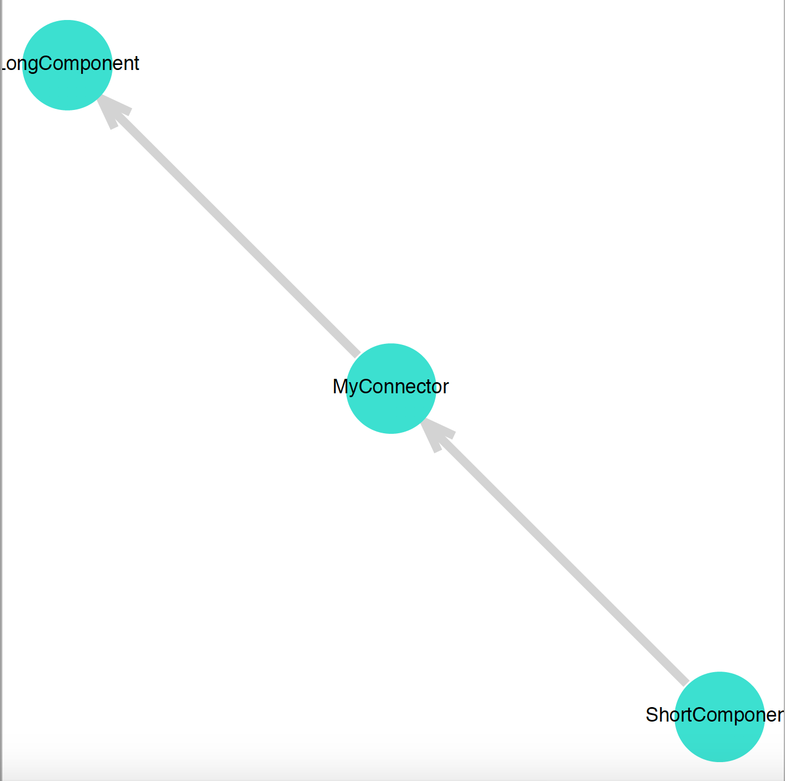
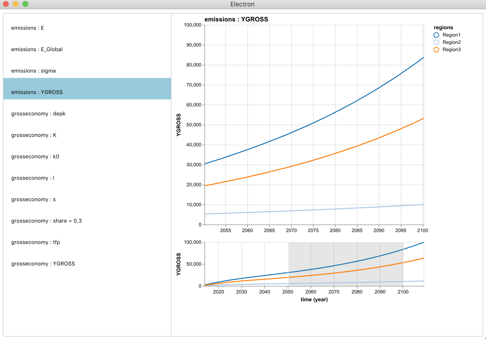

# User Guide

## Overview

See the Tutorials for in-depth examples of Mimi's functionality.

This guide is organized into six main sections for understanding how to use Mimi.

1) Defining components
2) Constructing a model
3) Running the model
4) Accessing results
5) Plotting and the Explorer UI
6) Sensitivity Analysis
7) Advanced topics

## Defining Components

Any Mimi model is made up of at least one component, so before you construct a model, you need to create your components.

A component can have any number of parameters and variables. Parameters are data values that will be provided to the component as input, and variables are values that the component will calculate in the `run_timestep` function when the model is run. The index of a parameter or variable determines the number of dimensions that parameter or variable has. They can be scalar values and have no index, such as parameter 'c' in the example below. They can be one-dimensional, such as the variable 'A' and the parameters 'd' and 'f' below. They can be two dimensional such as variable 'B' and parameter 'e' below. Note that any index other than 'time' must be declared at the top of the component, as shown by `regions = Index()` below.

The user must define a `run_timestep` function for each component. 

We define a component in the following way:

```julia
using Mimi

@defcomp MyComponentName begin
  regions = Index()

  A = Variable(index = [time])
  B = Variable(index = [time, regions])

  c = Parameter()
  d = Parameter(index = [time])
  e = Parameter(index = [time, regions])
  f = Parameter(index = [regions])

  function run_timestep(p, v, d, t)
    v.A[t] = p.c + p.d[t]
    for r in d.regions
      v.B[t, r] = p.f[r] * p.e[t, r]
    end
  end

end

```

The `run_timestep` function is responsible for calculating values for each variable in that component.  Note that the component state (defined by the first three arguments) has fields for the Parameters, Variables, and Dimensions of the component you defined. You can access each parameter, variable, or dimension using dot notation as shown above.  The fourth argument is an `AbstractTimestep`, i.e., either a `FixedTimestep` or a `VariableTimestep`, which represents which timestep the model is at.

The API for using the fourth argument, represented as `t` in this explanation, is described in this document under **Advanced Topics:  Timesteps and available functions**. 

To access the data in a parameter or to assign a value to a variable, you must use the appropriate index or indices (in this example, either the Timestep or region or both).

## Constructing a Model

The first step in constructing a model is to set the values for each index of the model. Below is an example for setting the 'time' and 'regions' indexes. The time index expects either a numerical range or an array of numbers.  If a single value is provided, say '100', then that index will be set from 1 to 100. Other indexes can have values of any type.

```julia
mymodel = Model()
set_dimension!(mymodel, :time, 1850:2200)
set_dimension!(mymodel, :regions, ["USA", "EU", "LATAM"])

```

*A Note on Time Indexes:* It is important to note that the values used for the time index are the *start times* of the timesteps.  If the range or array of time values has a uniform timestep length, the model will run *through* the last year of the range with a last timestep period length consistent with the other timesteps.  If the time values are provided as an array with non-uniform timestep lengths, the model will run *through* the last year in the array with a last timestep period length *assumed to be one*. 

The next step is to add components to the model. This is done by the following syntax:

```julia
add_comp!(mymodel, ComponentA, :GDP)
```

The first argument to `add_comp!` is the model, the second is the name of the ComponentId defined by `@defcomp`. If an optional third symbol is provided (as in the first line above), this will be used as the name of the component in this model. This allows you to add multiple versions of the same component to a model, with different names.

The next step is to set the values for all the parameters in the components. Parameters can either have their values assigned from external data, or they can internally connect to the values from variables in other components of the model.

To make an external connection, the syntax is as follows:

```julia
set_param!(mymodel, :ComponentName, :parametername, 0.8) # a scalar parameter
set_param!(mymodel, :ComponentName, :parametername2, rand(351, 3)) # a two-dimensional parameter

```

To make an internal connection, the syntax is as follows.  

```julia
connect_param!(mymodel, :TargetComponent=>:parametername, :SourceComponent=>:variablename)
connect_param!(mymodel, :TargetComponent=>:parametername, :SourceComponent=>:variablename)
```

If you wish to delete a component that has already been added, do the following:
```julia
delete!(mymodel, :ComponentName)
```
This will delete the component from the model and remove any existing connections it had. Thus if a different component was previously connected to this component, you will need to connect its parameter(s) to something else.

## Running a Model

After all components have been added to your model and all parameters have been connected to either external values or internally to another component, then the model is ready to be run. Note: at each timestep, the model will run the components in the order you added them. So if one component is going to rely on the value of another component, then the user must add them to the model in the appropriate order.

```julia
run(mymodel)

```

## Accessing Results

After a model has been run, you can access the results (the calculated variable values in each component) in a few different ways.

You can use the `getindex` syntax as follows:

```julia
mymodel[:ComponentName, :VariableName] # returns the whole array of values
mymodel[:ComponentName, :VariableName][100] # returns just the 100th value

```
Indexing into a model with the name of the component and variable will return an array with values from each timestep.
You can index into this array to get one value (as in the second line, which returns just the 100th value). Note that if the requested variable is two-dimensional, then a 2-D array will be returned.

You can also get data in the form of a dataframe, which will display the corresponding index labels rather than just a raw array. The syntax for this is:

```julia
getdataframe(mymodel, :ComponentName=>:Variable) # request one variable from one component
getdataframe(mymodel, :ComponentName=>(:Variable1, :Variable2)) # request multiple variables from the same component
getdataframe(mymodel, :Component1=>:Var1, :Component2=>:Var2) # request variables from different components

```

## Plotting and the Explorer UI

Mimi provides support for plotting using [VegaLite](https://github.com/vega/vega-lite) and [VegaLite.jl](https://github.com/fredo-dedup/VegaLite.jl) within the Mimi Explorer UI and `Mimi.plot` function, and the [LightGraphs](https://github.com/JuliaGraphs/LightGraphs.jl) and [MetaGraphs](https://github.com/JuliaGraphs/MetaGraphs.jl) for the `plot_comp_graph` function described below.

In order to view a DAG representing the component ordering and relationships, use the `plot_comp_graph` function to view a plot and optionally save it to a file.

```julia
run(m)
plot_comp_graph(m; filename = "MyFilePath.png")
```


Other plotting support is provided by the **Explorer UI**, rooted in `VegaLite`.  The `explore` function allows the user to view and explore the variables and parameters of a model run.  The explorer can be used in two primary ways.

In order to invoke the explorer UI and explore all of the variables and parameters in a model, simply call the function `explore` with the model run as the required argument, and a window title as an optional keyword argument, as shown below.  This will produce a new browser window containing a selectable list of parameters and variables, organized by component, each of which produces a graphic.  The exception here being that if the parameter or variable is a single scalar value, the value will appear alongside the name in the left-hand list.
 
```julia
run(mymodel)
explore(mymodel, title = "run1 results")
```



Alternatively, in order to view just one parameter or variable, call the (unexported) function `Mimi.plot` as below to return a plot object and automatically display the plot in a viewer, assuming `Mimi.plot` is the last command executed.  Note that `plot` is not exported in order to avoid namespace conflicts, but a user may import it if desired. This call will return the type `VegaLite.VLSpec`, which you may interact with using the API described in the [VegaLite.jl](https://github.com/fredo-dedup/VegaLite.jl) documentation.  For example, [VegaLite.jl](https://github.com/fredo-dedup/VegaLite.jl) plots can be saved as [PNG](https://en.wikipedia.org/wiki/Portable_Network_Graphics), [SVG](https://en.wikipedia.org/wiki/Scalable_Vector_Graphics), [PDF](https://en.wikipedia.org/wiki/PDF) and [EPS](https://en.wikipedia.org/wiki/Encapsulated_PostScript) files. You may save a plot using the `save` function. Note that while `explore(m)` returns interactive plots for line graphs, `Mimi.plot(m, :foo, :bar)` will return only static plots. 

```julia
using VegaLite
run(mymodel)
p = Mimi.plot(mymodel, :component1, :parameter1)
save("figure.svg", p)
```


These two functions, `explore` and `plot` also have methods applicable to the sensitivity analysis support described in the next section. Details can be found in the linked [internals documentation](https://github.com/mimiframework/Mimi.jl/blob/master/docs/src/internals/montecarlo.md) as well as [Tutorial 4: Sensitivity Analysis (SA) Support](@ref).

## Sensitivity Analysis (SA) Support

Mimi includes a host of routines which support running various sensitivity analysis methods on Mimi models. The best current documentation on the SA API is the internals documentation [here](https://github.com/mimiframework/Mimi.jl/blob/master/docs/src/internals/montecarlo.md), which provides a working, although informal, description of the SA support of Mimi. This file should be used in conjunction with the examples in [Tutorial 4: Sensitivity Analysis (SA) Support](@ref), since the documentation covers more advanced options such as non-stochastic scenarios and running multiple models, which are not yet included in this tutorial.

## Advanced Topics

### Timesteps and available functions

An `AbstractTimestep` i.e. a `FixedTimestep` or a `VariableTimestep` is a type defined within Mimi in "src/time.jl". It is used to represent and keep track of time indices when running a model.

In the `run_timestep` functions which the user defines, it may be useful to use any of the following functions, where `t` is an `AbstractTimestep` object:

```julia
is_first(t) # returns true or false, true if t is the first timestep to be run
is_last(t) # returns true or false, true if t is the last timestep to be run
gettime(t) # returns the year represented by timestep t
is_time(t, y) # Return true or false, true if the current time (year) for t is y
is_timestep(t, s) # Return true or false, true if t timestep is step s.
```

The API details for AbstractTimestep object `t` are as follows:

- you may index into a variable or parameter with `[t]` or `[t +/- x]` as usual
- to access the time value of `t` (currently a year) as a `Number`, use `gettime(t)`
- useful functions for commonly used conditionals are `is_first(t)`,`is_last(t)`, `is_time(t, s)`, and `is_timestep(t, y)` as listed above
- to access the index value of `t` as a `Number` representing the position in the time array, use `t.t`.  Users are encouraged to avoid this access, and instead use the options listed above or a separate counter variable. each time the function gets called. 

Indexing into a variable or parameter's `time` dimension with an `Integer` is deprecated and will soon error. Instead, users should take advantage of the `TimestepIndex` and `TimestepValue` types. For examples we will refer back to our component definition above, and repeated below.
```julia
@defcomp MyComponentName begin
  regions = Index()

  A = Variable(index = [time])
  B = Variable(index = [time, regions])

  c = Parameter()
  d = Parameter(index = [time])
  e = Parameter(index = [time, regions])
  f = Parameter(index = [regions])

  function run_timestep(p, v, d, t)
    v.A[t] = p.c + p.d[t]
    for r in d.regions
      v.B[t, r] = p.f[r] * p.e[t, r]
    end
  end

end
```
`TimestepIndex` has one field, `index`, which refers to the absolute index in the parameter or variable array's `time` dimension. Thus, constructing a `TimestepIndex` is done by simply writing `TimestepIndex(index::Int)`. Looking back at our original component example
one could modify the first line of `run_timestep` to always refer to the first timestep of `p.d` with the following. One may index into the `time` dimension with a single `TimestepIndex`, or an `Array` of them.
```julia
v.A[t] = p.c + p.d[TimestepIndex(1)]
```
`TimestepValue` has two fields, `value` and `offset`, referring to the value within the `time` dimension and an optional `offset` from that `value`. Thus, constructing a `TimestepValue` is done either by writing `TimestepValue(value)`, with an implied offset of 0, or `TimestepValue(value, offset = i::Int)`, with an explicit offset of i. One may index into the `time` dimension with a single `TimestepValue`, or an `Array` of them. For example, you can use a `TimestepValue` to keep track of a baseline year.
```julia
v.A[t] = p.c + p.d[TimestepValue(2000)]
```
You may also use shorthand to create arrays of `TimestepIndex` using Colon syntax.
```julia
TimestepIndex(1):TimestepIndex(10) # implicit step size of 1
TimestepIndex(1):2:TimestepIndex(10) # explicit step of type Int 
```
Both `TimestepIndex` and `TimestepArray` have methods to support addition and subtraction of integers.  Note that the addition or subtraction is relative to the definition of the `time` dimension, so while `TimestepIndex(1) + 1 == TimestepIndex(2)`, `TimestepValue(2000) + 1` could be equivalent to `TimestepValue(2001)` **if** 2001 is the next year in the time dimension, or `TimestepValue(2005)` if the array has a step size of 5. Hence adding or subtracting is relative to the definition of the `time` dimension. 


### Parameter connections between different length components

As mentioned earlier, it is possible for some components to start later or end sooner than the full length of the model. This presents potential complications for connecting their parameters. If you are setting the parameters to external values, then the provided values just need to be the right size for that component's parameter. If you are making an internal connection, this can happen in one of two ways:

1. A shorter component is connected to a longer component. In this case, nothing additional needs to happen. The shorter component will pick up the correct values it needs from the longer component.
2. A longer component is connected to a shorter component. In this case, the shorter component will not have enough values to supply to the longer component. In order to make this connection, the user must also provide an array of backup data for the parameter to default to when the shorter component does not have values to give. Do this in the following way:

```julia
backup = rand(100) # data array of the proper size
connect_param!(mymodel, :LongComponent=>:parametername, :ShortComponent=>:variablename, backup)
```

Note: for now, to avoid discrepancy with timing and alignment, the backup data must be the length of the whole component's first to last time, even though it will only be used for values not found in the shorter component.

### More on parameter indices

As mentioned above, a parameter can have no index (a scalar), or one or multiple of the model's indexes. A parameter can also have an index specified in the following ways:

```julia
@defcomp MyComponent begin
  p1 = Parameter(index=[4]) # an array of length 4
  p2::Array{Float64, 2} = Parameter() # a two dimensional array of unspecified length
end
```
In both of these cases, the parameter's values are stored of as an array (p1 is one dimensional, and p2 is two dimensional). But with respect to the model, they are considered "scalar" parameters, simply because they do not use any of the model's indices (namely 'time', or 'regions').

### Updating an external parameter

When `set_param!` is called, it creates an external parameter by the name provided, and stores the provided scalar or array value. It is possible to later change the value associated with that parameter name using the functions described below. If the external parameter has a `:time` dimension, use the optional argument `update_timesteps=true` to indicate that the time keys (i.e., year labels) associated with the parameter should be updated in addition to updating the parameter values.

```julia
update_param!(mymodel, :parametername, newvalues) # update values only 
update_param!(mymodel, :parametername, newvalues, update_timesteps=true) # also update time keys
```

Note: `newvalues` must be the same size and type (or be able to convert to the type) of the old values stored in that parameter.

### Setting parameters with a dictionary

In larger models it can be beneficial to set some of the external parameters using a dictionary of values. To do this, use the following function:

```julia
set_leftover_params!(mymodel, parameters)
```

Where `parameters` is a dictionary of type `Dict{String, Any}` where the keys are strings that match the names of the unset parameters in the model, and the values are the values to use for those parameters.

### Using NamedArrays for setting parameters

When a user sets a parameter, Mimi checks that the size and dimensions match what it expects for that component. If the user provides a NamedArray for the values, Mimi will further check that the names of the dimensions match the expected dimensions for that parameter, and that the labels match the model's index values for those dimensions. Examples of this can be found in "test/test_parameter_labels.jl".

### The internal 'build' function and model instances

 When you call the run function on your model, first the internal `build` function is called, which produces a ModelInstance, and then the ModelInstance is run. A model instance is an instantiated version of the model you have designed where all of the component constructors have been called and all of the data arrays have been allocated. If you wish to create and run multiple versions of your model, you can use the intermediate build function and store the separate ModelInstances. This may be useful if you want to change some parameter values, while keeping the model's structure mostly the same. For example:

```julia
instance1 = Mimi.build(mymodel)
run(instance1)

update_param!(mymodel, paramname, newvalue)
instance2 = Mimi.build(mymodel)
run(instance2)

result1 = instance1[:Comp, :Var]
result2 = instance2[:Comp, :Var]
```

Note that you can retrieve values from a ModelInstance in the same way previously shown for indexing into a model.

### The init function ###

The `init` function can optionally be called within `@defcomp` and **before** `run_timestep`.  Similarly to `run_timestep`, this function is called with parameters `init(p, v, d)`, where the component state (defined by the first three arguments) has fields for the Parameters, Variables, and Dimensions of the component you defined.   

If defined for a specific component, this function will run **before** the timestep loop, and should only be used for parameters or variables without a time index e.g. to compute the values of scalar variables that only depend on scalar parameters. Note that when using `init`, it may be necessary to add special handling in the `run_timestep` function for the first timestep, in particular for difference equations.  A skeleton `@defcomp` script using both `run_timestep` and `init` would appear as follows:

```julia
@defcomp component1 begin

    # First define the state this component will hold
    savingsrate = Parameter()

    # Second, define the (optional) init function for the component
    function init(p, v, d)
    end

    # Third, define the run_timestep function for the component
    function run_timestep(p, v, d, t)
    end

end
```
