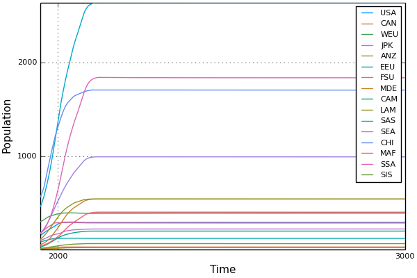

# User Guide

## Overview

See the Tutorial for in depth examples of one-region and multi-region models.

This guide is organized into four main sections for understanding how to use Mimi.

1) Defining components
2) Constructing a model
3) Running the model
4) Results

### Defining Components

Any Mimi model is made up of at least one component, so before you construct a model, you need to create your components.
We define a component in the following way:

```julia
using Mimi

@defcomp MyComponentName begin
  regions = index()

  A = Variable(index = [time])
  B = Variable(index = [time, regions])
  c = Parameter()
  d = Parameter(index = [time])
  e = Parameter(index = [time, regions])
  f = Parameter(index = [regions])
end
```
A component can have any number of parameters and variables. Parameters are data values that will be provided to the component as input, and variables are values that the component will calculate in the run_timestep function when the model is run. The index of a parameter or variable determines the number of dimensions that parameter or variable has. They can be scalar values and have no index, such as parameter 'c' in the example above. They can be one-dimensional, such as the variable 'A' and the parameters 'd' and 'f' above. They can be two dimensional such as variable 'B' and parameter 'e' above.

The user must define a run_timestep function for each component. That looks like the following:

```julia

function run_timestep(c::MyComponentName, t::Timestep)
  p = c.Parameters
  v = c.Variables
  d = c.Dimensions

  v.A[t] = p.c + p.d[t]
  for r in d.regions
    v.B[t, r] = p.f[r] * p.e[t, r]
  end
end

```

The run_timestep function is responsible for calculating values for each variable in that component. The first argument to the function is a 'ComponentState', a type whose name matches the component you defined. The second argument is a Timestep. In older versions of Mimi, this was just an integer. Read more about Timestep objects below.

#### More about parameter and variable indexes

#### More about Timesteps

### Constructing a Model

```julia

mymodel = Model()
setindex(mymodel, :time, 1850:2200)
setindex(mymodel, :regions, ["USA", "EU", "LATAM"])

```


### Running a Model


### Results

getindex
getdataframe
plotting

## Plotting



Mimi provides support for plotting using the [Plots](https://github.com/tbreloff/Plots.jl) module. Mimi extends Plots by adding an additional method to the `Plots.plot` function. Specifically, it adds a new method with the signature

```julia
function Plots.plot(m::Model, component::Symbol, parameter::Symbol ; index::Symbol, legend::Symbol, x_label::String, y_label::String)
```
A few important things to note:

- The model `m` must be built and run before it is passed into `plot`
- `index`, `legend`, `x_label`, and `y_label` are optional keyword arguments. If no values are provided, the plot will index by `time` and use the data it has to best fill in the axis labels.
- `legend` should be a `Symbol` that refers to an index on the model set by a call to `setindex`

This method returns a ``Plots.Plot`` object, so calling it in an instance of an IJulia Notebook will display the plot. Because this method is defined on the Plots package, it is easy to use the other features of the Plots package. For example, calling `savefig("x")` will save the plot as `x.png`, etc. See the [Plots Documentaton](https://juliaplots.github.io/) for a full list of capabilities.
